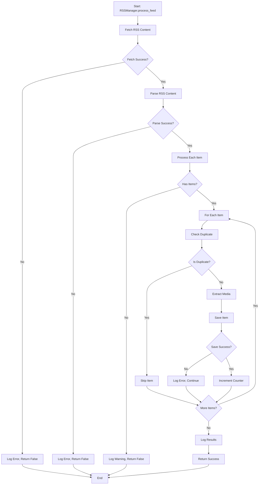
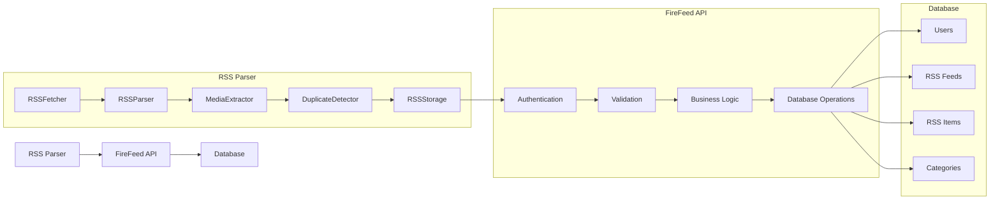

# FireFeed RSS Parser - Architecture Documentation

This document describes the architecture of the FireFeed RSS Parser microservice.

## Table of Contents

- [Overview](#overview)
- [Architecture Principles](#architecture-principles)
- [Component Architecture](#component-architecture)
- [Service Dependencies](#service-dependencies)
- [Data Flow](#data-flow)
- [Design Patterns](#design-patterns)
- [Technology Stack](#technology-stack)
- [Scalability Considerations](#scalability-considerations)
- [Performance Optimization](#performance-optimization)
- [Security Architecture](#security-architecture)

## Overview

The FireFeed RSS Parser is a production-ready microservice designed to fetch, parse, and process RSS/Atom feeds. It follows modern software architecture principles and is built for scalability, reliability, and maintainability.

### Key Features

- **Microservice Architecture** - Independent, deployable service
- **Async Processing** - High-performance concurrent processing
- **Modular Design** - Clear separation of concerns
- **Production Ready** - Monitoring, logging, health checks
- **Extensible** - Easy to add new features and integrations

## Architecture Principles

### 1. Single Responsibility Principle

Each component has a single, well-defined responsibility:

- **RSSFetcher** - Fetches RSS feed content from URLs
- **RSSParser** - Parses RSS/Atom XML content
- **MediaExtractor** - Extracts media content from HTML
- **DuplicateDetector** - Detects duplicate RSS items
- **RSSStorage** - Stores processed items via API
- **RSSManager** - Orchestrates the processing pipeline

### 2. Dependency Injection

The service uses dependency injection for:

- **Testability** - Easy to mock dependencies in tests
- **Flexibility** - Easy to swap implementations
- **Loose Coupling** - Components are loosely coupled

### 3. Interface Segregation

Each service implements specific interfaces:

```python
class RSSFetcherInterface:
    async def fetch_rss(self, url: str) -> str: ...

class RSSParserInterface:
    async def parse_rss(self, content: str) -> Dict: ...

class RSSStorageInterface:
    async def save_rss_item(self, item: RSSItem) -> int: ...
```

### 4. Open/Closed Principle

The architecture is open for extension but closed for modification:

- New parsers can be added without changing existing code
- New storage backends can be integrated easily
- New media extractors can be plugged in

## Component Architecture

### Core Services

```
┌─────────────────────────────────────────────────────────────┐
│                    RSS Parser Service                       │
├─────────────────────────────────────────────────────────────┤
│  ┌─────────────────┐  ┌─────────────────┐  ┌──────────────┐ │
│  │   RSSManager    │  │  HealthChecker  │  │   Config     │ │
│  │                 │  │                 │  │              │ │
│  └─────────────────┘  └─────────────────┘  └──────────────┘ │
└─────────────────────────────────────────────────────────────┘
                              │
                              │
                              ▼
┌─────────────────────────────────────────────────────────────┐
│                    Service Layer                            │
├─────────────────────────────────────────────────────────────┤
│  ┌─────────────────┐  ┌─────────────────┐  ┌──────────────┐ │
│  │   RSSFetcher    │  │   RSSParser     │  │MediaExtractor│ │
│  │                 │  │                 │  │              │ │
│  └─────────────────┘  └─────────────────┘  └──────────────┘ │
│  ┌─────────────────┐  ┌─────────────────┐  ┌──────────────┐ │
│  │DuplicateDetector│  │   RSSStorage    │  │TranslationSvc│ │
│  │                 │  │                 │  │              │ │
│  └─────────────────┘  └─────────────────┘  └──────────────┘ │
└─────────────────────────────────────────────────────────────┘
                              │
                              │
                              ▼
┌─────────────────────────────────────────────────────────────┐
│                    Infrastructure                           │
├─────────────────────────────────────────────────────────────┤
│  ┌─────────────────┐  ┌─────────────────┐  ┌──────────────┐ │
│  │ FireFeed API    │  │   HTTP Client   │  │   Logging    │ │
│  │   Client        │  │                 │  │              │ │
│  └─────────────────┘  └─────────────────┘  └──────────────┘ │
│  ┌─────────────────┐  ┌─────────────────┐  ┌──────────────┐ │
│  │   Monitoring    │  │   Validation    │  │   Retry      │ │
│  │                 │  │                 │  │              │ │
│  └─────────────────┘  └─────────────────┘  └──────────────┘ │
└─────────────────────────────────────────────────────────────┘
```

### Service Descriptions

#### RSSManager
**Role:** Orchestrates the entire RSS processing pipeline
**Responsibilities:**
- Coordinates between services
- Handles error propagation
- Manages processing workflow
- Implements retry logic

#### RSSFetcher
**Role:** Fetches RSS feed content from remote URLs
**Responsibilities:**
- HTTP requests with proper headers
- Timeout and retry handling
- Content validation
- ETag and caching support

#### RSSParser
**Role:** Parses RSS/Atom XML content into structured data
**Responsibilities:**
- XML parsing with feedparser
- Content extraction
- Date parsing and normalization
- Multiple content type support

#### MediaExtractor
**Role:** Extracts media content from HTML
**Responsibilities:**
- OpenGraph metadata extraction
- Twitter Card parsing
- Image/video/audio detection
- URL validation

#### DuplicateDetector
**Role:** Prevents duplicate RSS items
**Responsibilities:**
- GUID-based duplicate detection
- Link-based duplicate detection
- Title-based duplicate detection
- API integration for checks

#### RSSStorage
**Role:** Stores processed RSS items
**Responsibilities:**
- API communication
- Data validation
- Error handling
- Retry mechanisms

## Service Dependencies

### External Dependencies

```
FireFeed RSS Parser
    ├── FireFeed API (HTTP)
    ├── HTTPX (Async HTTP client)
    ├── feedparser (RSS/Atom parsing)
    ├── BeautifulSoup4 (HTML parsing)
    ├── lxml (XML processing)
    └── Prometheus Client (Metrics)
```

### Internal Dependencies

```
RSSManager
    ├── RSSFetcher
    ├── RSSParser
    ├── MediaExtractor
    ├── DuplicateDetector
    └── RSSStorage

RSSStorage
    └── APIClient (from firefeed_core)

DuplicateDetector
    └── APIClient (from firefeed_core)

MediaExtractor
    └── HTTPX Async Client
```

## Data Flow

### Complete Processing Flow



### API Integration Flow



## Design Patterns

### 1. Strategy Pattern

Used for different parsing strategies:

```python
class RSSParserStrategy(ABC):
    @abstractmethod
    async def parse(self, content: str) -> Dict[str, Any]:
        pass

class RSS2Parser(RSSParserStrategy):
    async def parse(self, content: str) -> Dict[str, Any]:
        # RSS 2.0 specific parsing
        pass

class AtomParser(RSSParserStrategy):
    async def parse(self, content: str) -> Dict[str, Any]:
        # Atom specific parsing
        pass
```

### 2. Factory Pattern

Used for creating service instances:

```python
class ServiceFactory:
    @staticmethod
    def create_rss_parser() -> RSSParser:
        return RSSParser()
    
    @staticmethod
    def create_media_extractor() -> MediaExtractor:
        return MediaExtractor()
```

### 3. Observer Pattern

Used for monitoring and metrics:

```python
class MetricsObserver:
    def update(self, event: str, data: Dict):
        # Update metrics
        pass

class HealthObserver:
    def update(self, event: str, data: Dict):
        # Update health status
        pass
```

### 4. Decorator Pattern

Used for retry mechanisms:

```python
@retry_with_backoff(max_retries=3, base_delay=1.0)
async def fetch_rss(self, url: str) -> str:
    # Fetch implementation
    pass
```

### 5. Repository Pattern

Used for data access abstraction:

```python
class RSSRepository:
    async def get_feeds(self) -> List[RSSFeed]:
        pass
    
    async def save_item(self, item: RSSItem) -> int:
        pass
```

## Technology Stack

### Core Technologies

- **Python 3.11** - Modern Python with async/await
- **HTTPX** - Async HTTP client
- **feedparser** - RSS/Atom parsing
- **BeautifulSoup4** - HTML parsing
- **lxml** - XML processing

### Development Tools

- **pytest** - Testing framework
- **ruff** - Linting
- **mypy** - Type checking
- **black** - Code formatting
- **isort** - Import sorting

### Infrastructure

- **Docker** - Containerization
- **Prometheus** - Metrics
- **Kubernetes** - Orchestration
- **structlog** - Structured logging

## Scalability Considerations

### 1. Horizontal Scaling

The service is designed to scale horizontally:

- **Stateless Design** - No local state storage
- **Shared Database** - All instances use the same API
- **Load Balancing** - Multiple instances behind load balancer
- **Auto-scaling** - Kubernetes auto-scaling based on metrics

### 2. Concurrent Processing

Multiple levels of concurrency:

- **Async/Await** - Non-blocking I/O operations
- **Concurrent Feeds** - Multiple feeds processed simultaneously
- **Connection Pooling** - Efficient HTTP connection reuse
- **Task Scheduling** - Smart task distribution

### 3. Resource Management

Efficient resource usage:

- **Memory Management** - Proper cleanup of resources
- **Connection Limits** - Controlled number of concurrent connections
- **Timeout Handling** - Prevents resource exhaustion
- **Garbage Collection** - Efficient memory cleanup

### 4. Caching Strategy

Multi-level caching:

- **HTTP Caching** - ETag and Last-Modified headers
- **Content Caching** - RSS content caching
- **DNS Caching** - DNS resolution caching
- **Database Caching** - API response caching

## Performance Optimization

### 1. Network Optimization

- **Connection Pooling** - Reuse HTTP connections
- **Compression** - Gzip compression for HTTP
- **Timeout Tuning** - Optimal timeout values
- **DNS Optimization** - DNS caching and optimization

### 2. Processing Optimization

- **Async Processing** - Non-blocking operations
- **Batch Processing** - Process multiple items together
- **Lazy Loading** - Load data only when needed
- **Memory Optimization** - Efficient data structures

### 3. Database Optimization

- **Indexing** - Proper database indexes
- **Query Optimization** - Efficient API queries
- **Connection Pooling** - Database connection reuse
- **Caching** - Query result caching

### 4. Monitoring and Profiling

- **Performance Metrics** - Track key performance indicators
- **Profiling** - Identify performance bottlenecks
- **Load Testing** - Test under various loads
- **A/B Testing** - Compare performance improvements

## Security Architecture

### 1. Authentication and Authorization

- **API Keys** - Service-to-service authentication
- **JWT Tokens** - User authentication
- **Rate Limiting** - Prevent abuse
- **IP Whitelisting** - Restrict access

### 2. Data Protection

- **HTTPS** - Encrypted communication
- **Input Validation** - Prevent injection attacks
- **Output Encoding** - Prevent XSS attacks
- **Data Sanitization** - Clean user input

### 3. Network Security

- **Firewall Rules** - Network access control
- **Security Groups** - Cloud security groups
- **VPN** - Secure network connections
- **TLS** - Transport layer security

### 4. Monitoring and Logging

- **Security Logs** - Track security events
- **Audit Trails** - Record all actions
- **Alerting** - Security breach notifications
- **Incident Response** - Security incident handling

### 5. Compliance

- **GDPR** - Data protection compliance
- **Privacy** - User privacy protection
- **Data Retention** - Proper data lifecycle
- **Access Control** - Role-based access

## Conclusion

The FireFeed RSS Parser architecture is designed for:

- **Scalability** - Handle growing loads
- **Reliability** - High availability and fault tolerance
- **Maintainability** - Clean, modular code
- **Security** - Robust security measures
- **Performance** - Optimized for speed and efficiency

This architecture provides a solid foundation for a production-ready RSS parsing microservice that can grow and evolve with changing requirements.